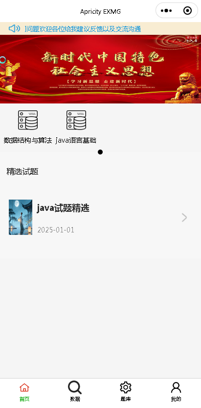
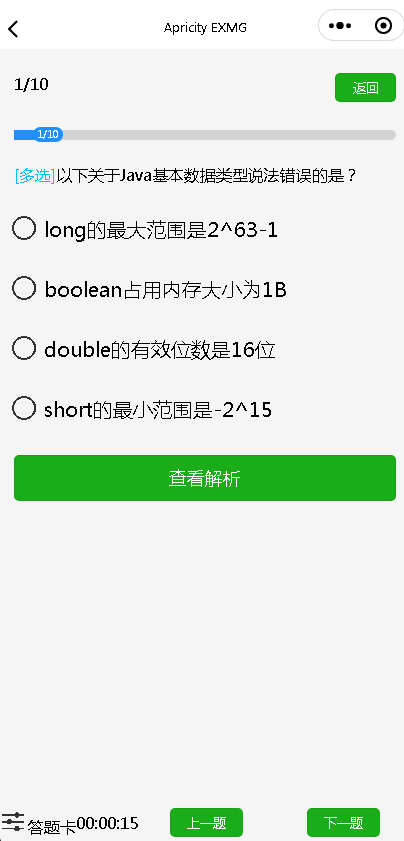
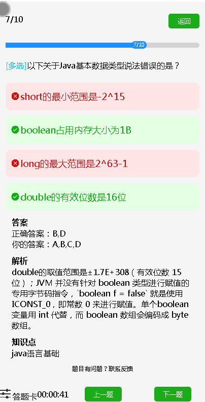

# EXMG

答题应用小程序

原来用于给自己做备考，考证，学习面试等需要开发的答题小程序,现在很久没用了,打算给大家贡献出来,供有需要的人学习或使用

都是基本的技术栈，没什么含金量，对于有基本的前后端开发经验的人应该都能很快熟悉上手，可以直接部署自己用，或进行二次开发，不建议直接商用

本人很难有空再维护,有bug各位使用者自行修复即可

## 项目结构

- exmg: 后端服务,使用 java springboot
    - exmg-admin 提供管理页面的接口
    - exmg-gateway 提供小程序的接口
    - exmg-core 公共逻辑
- exmg-front: 管理页面端，基于vue-element-admin 定制开发
    - 试题分类管理
    - 考试管理，查看用户考试情况
    - 题目管理，支持批量导入题目
- wxmin: 小程序端, exng-uniapp 作为最终版,其他版本废弃，项目比较老，在微信开发者工具启动时注意将调试基础库版本2.24以下

## 部署项目

- exmg: 传统springboot 项目部署，数据源配置改为自己的 `application-database-dev.yml` 和 `application-database-prod.yml`。exmg-gateway 配置中 `application.yml` 和 `logback-spring.xml` 配置路径改成自己的
- exmg-front: 传统vue 项目部署
- wxmin: 放微信开发者工具部署，`request.js` 中部署域名换成自己的

## 演示图片

